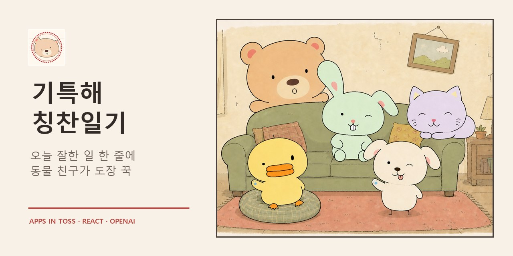
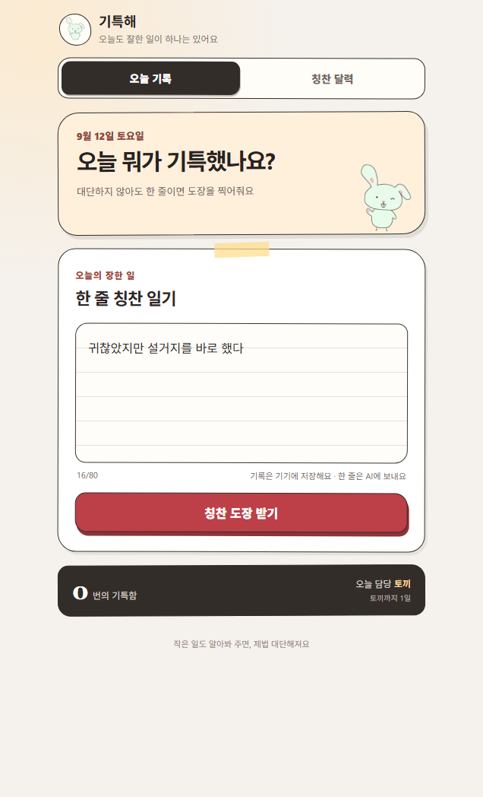
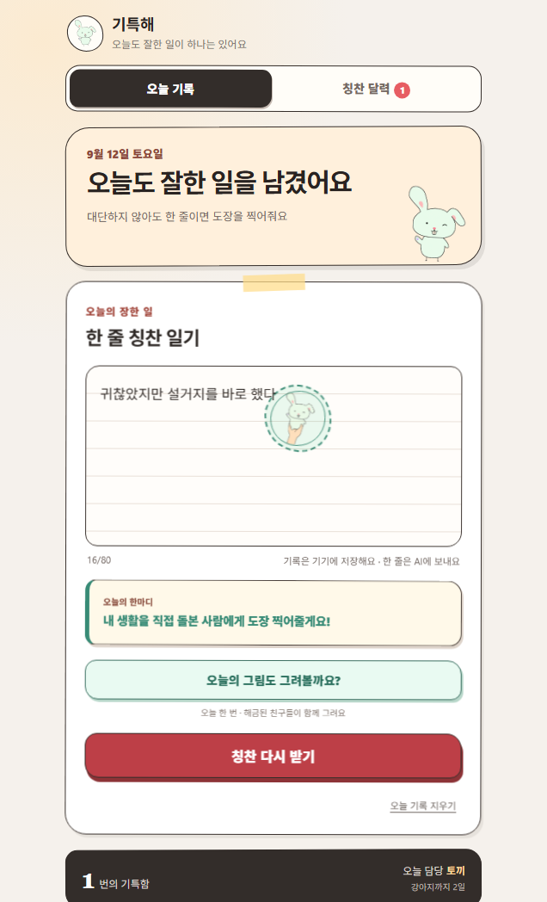
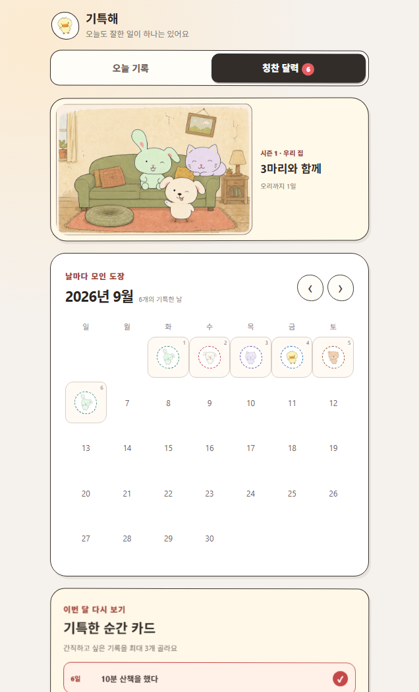
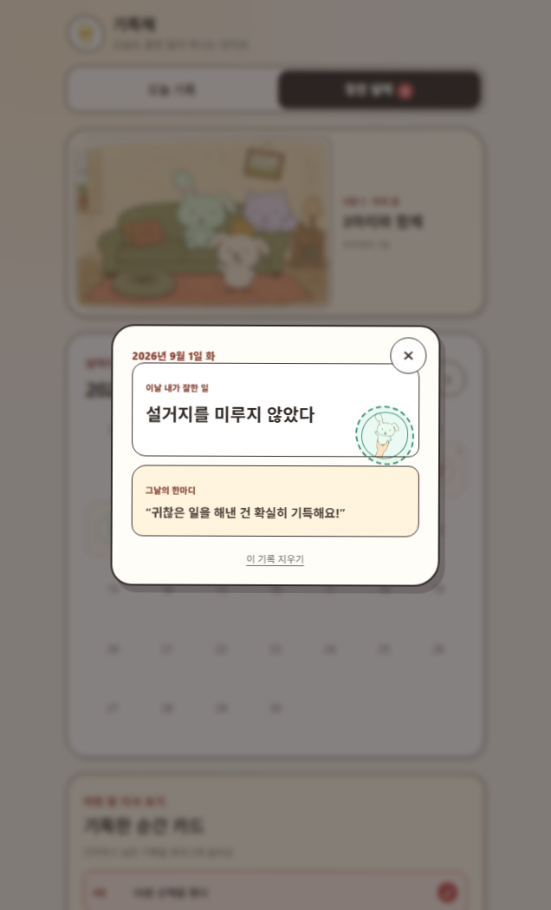
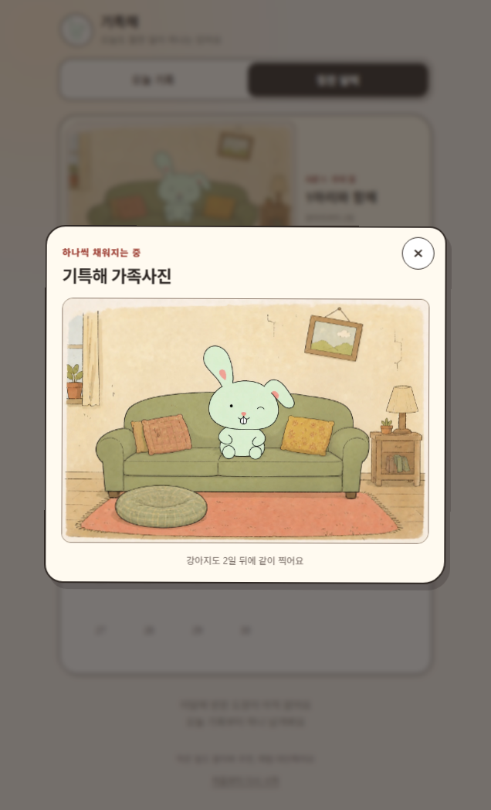
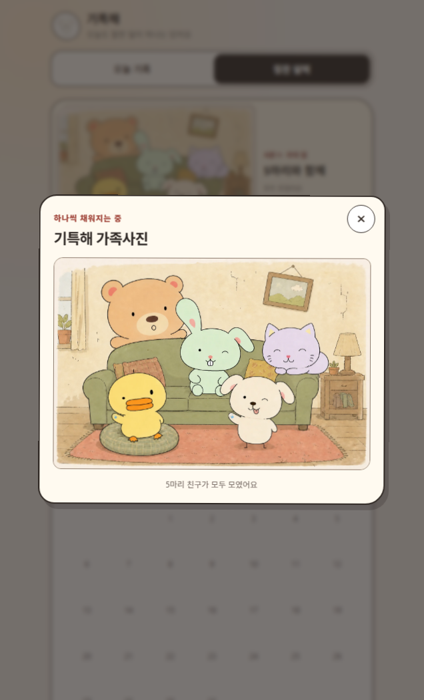
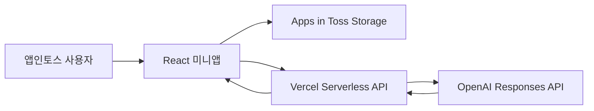

<div align="center">
  
  <h1>기특해: 칭찬일기</h1>
  <p>오늘 잘한 일 한 줄에 동물 친구가 칭찬 도장을 찍어주는 앱인토스 미니앱</p>
  <p><strong>Apps in Toss 출시</strong> · React · TypeScript · Vercel · OpenAI</p>
  <a href="https://github.com/yoon778/giteukhae/actions/workflows/ci.yml"></a>
</div>



## 프로젝트 소개

하루를 돌아봤을 때 대단한 성취가 없어도 작은 행동 하나는 인정받을 수 있게 만든 한 줄 일기다. 사용자가 오늘 잘한 일을 적으면 AI가 맥락을 분류하고, 해금된 동물의 말투로 짧은 칭찬을 만든다. 기록과 칭찬 도장은 기기에 저장되어 달력에서 다시 볼 수 있다.

### 해결하려던 문제

- 긴 일기는 시작하기 어렵고 꾸준히 쓰기 부담스러움
- 작은 성취는 쉽게 잊히고 기록할 가치가 없다고 느끼기 쉬움
- 단순 출석 보상보다 다시 열어볼 감정적 이유가 필요함

### 핵심 경험

1. 오늘 잘한 일 최대 80자 입력
2. 동물별 말투가 반영된 AI 한마디 생성
3. 손으로 찍는 듯한 칭찬 도장 애니메이션
4. 날짜별 기록과 도장을 달력에서 다시 확인
5. 누적 기록에 따라 동물과 가족사진 해금

## 화면

<p align="center">
  
  
  
</p>

<p align="center">
  
  
  
</p>

## 주요 기능

- 하루 한 줄 기록과 날짜별 저장
- 토끼, 강아지, 고양이, 오리, 곰 순차 해금
- 해금된 동물의 랜덤 등장과 첫인사
- 동물별 말투를 적용한 AI 칭찬
- AI 오류·시간 초과 시 로컬 코멘트 자동 대체
- 칭찬 달력과 기록 상세 팝업
- 기록 수에 따라 빈자리가 채워지는 가족사진
- 개별 기록 삭제와 전체 초기화
- 개발 환경 전용 날짜 이동 도구

## 기술 구조



| 영역 | 구성 | 선택 이유 |
|---|---|---|
| 미니앱 | React 19, TypeScript, Vite | 앱인토스 Web Framework와 빠른 개발 |
| 기기 저장 | Apps in Toss `Storage`, `localStorage` 대체 | 별도 계정·DB 없이 기록 유지 |
| AI 서버 | Vercel Serverless Function | API 키를 번들에서 분리 |
| AI | OpenAI Responses API, `gpt-5-nano` | 짧은 분류·한마디 생성에 맞춘 비용 |
| 품질 | Node Test Runner, oxlint, TypeScript | 핵심 로직 회귀와 정적 오류 방지 |

## 개발 중 해결한 문제

### 기기 저장소와 브라우저 저장소 불일치

저장값에 수정 시각을 포함한 envelope를 적용했다. 두 저장소에서 더 최신인 값을 복원해 앱 재실행 후 기록 수와 달력이 달라지는 문제를 방지했다.

### 기록 수와 해금 일수 혼동

전체 기록 수, 월별 기록 수, 해금에 사용되는 고유 날짜 수를 분리했다. 개발용 가상 날짜는 실제 해금 진행도에 포함하지 않는다.

### AI의 과도한 추측

입력에 없는 행동·감정·의도를 만들지 않도록 지시하고 결과를 JSON Schema로 제한했다. 의미가 불분명한 입력은 `unclear`로 분류하며, 네트워크 실패 시 앱 내부 코멘트로 대체한다.

### 가족사진 단계별 잔상

완성 사진을 CSS로 잘라 쓰는 대신 해금 단계별 완전한 이미지를 사용했다. 각 단계의 동물 수와 주변 잔상을 스크린샷으로 검증한다.

## 보안과 개인정보

- `OPENAI_API_KEY`와 `SAFETY_ID_SALT`는 Vercel 환경변수로만 관리
- 허용된 앱인토스 Origin만 API 호출 가능
- 요청 본문 4KB, 기록 80자, 분당 호출 수 제한
- OpenAI 응답 JSON Schema 검증
- 사용자 원문과 API 키를 서버 로그에 남기지 않음
- OpenAI 요청에 `store: false` 적용
- 기록 원문은 별도 회원 DB 없이 사용자 기기에 저장

자세한 내용은 [AI API 규격](docs/AI_API.md), [개인정보 처리 안내 초안](docs/PRIVACY.md) 참고

## 실행

요구 환경: Node.js 22 이상

```bash
npm ci
npm run dev
```

AI 서버 연결 시 `.env.example`을 참고해 로컬 개발용 `.env.local`을 작성한다.

```bash
VITE_PRAISE_API_URL=https://your-api.example.com/api/praise
```

실제 `OPENAI_API_KEY`는 미니앱 환경 파일에 넣지 않고 Vercel 환경변수로만 등록한다.

## 검증

```bash
npm test
npm run lint
npm run build:web
```

앱인토스 업로드용 AIT 생성:

```bash
npm run build
```

## 문서

- [제품 정의](docs/PRODUCT.md)
- [AI API 규격](docs/AI_API.md)
- [동물 추가 가이드](docs/ANIMAL_GUIDE.md)
- [개인정보 처리 안내 초안](docs/PRIVACY.md)
- [앱인토스 등록·출시 절차](docs/RELEASE.md)
- [동물 시스템과 품질 테스트 기록](docs/testing/animal-system-and-quality.tdd.md)
